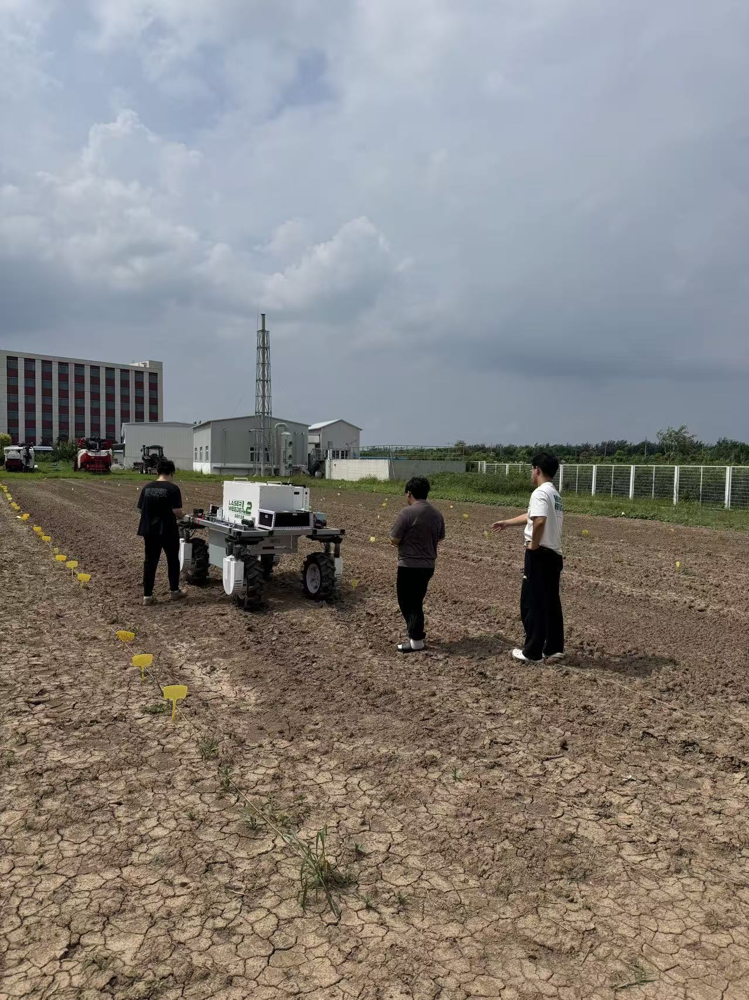

We are excited to share that our team has begun field testing **WeedHitter 2**, the latest version of our laser weeding robot.

WeedHitter 2 features a new **modular design** that brings the platform closer to an industrial-ready system. The redesigned architecture supports more efficient integration, testing, maintenance, and future upgrades as we continue moving the technology from research prototypes toward practical agricultural deployment.

<!--more-->

Alongside the development of the new robot, we have collected and annotated **more than one million field data samples** from farms across North China. This large-scale, real-world dataset captures diverse crops, weeds, growth stages, and field conditions, providing a strong foundation for training and evaluating the robot's perception system.

Our current field trials are helping us assess the reliability and integration of the new modular platform under realistic operating conditions. The results will guide the next stage of development as we work toward a robust, scalable, and practical laser weeding solution for precision agriculture.

We look forward to sharing more progress from WeedHitter 2 soon. 🌱🤖
